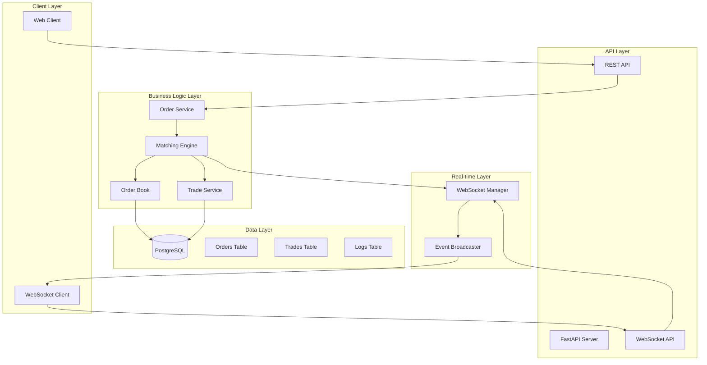
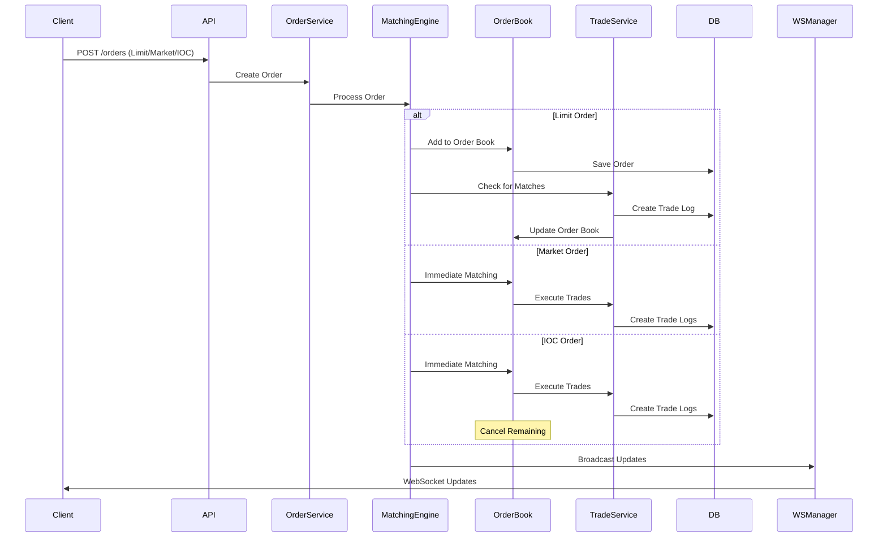
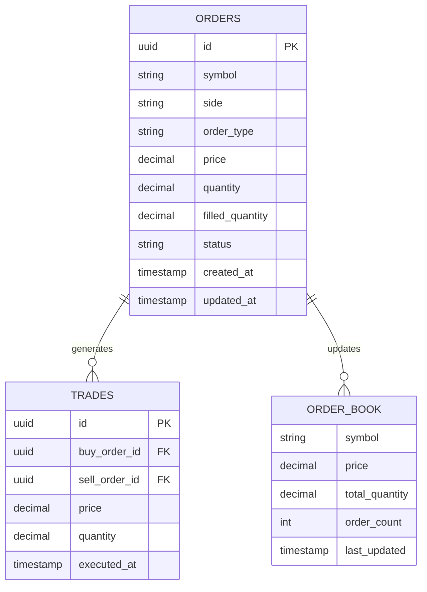

# V-Exchange 매칭 엔진 아키텍처

## 🏗️ 전체 시스템 아키텍처

## 🔄 주문 처리 흐름도

## 📊 데이터 모델 관계

## 🎯 핵심 컴포넌트

### 1. **Matching Engine (매칭 엔진)**
- Price-Time Priority 알고리즘
- Market/Limit/IOC 주문 지원
- 실시간 매칭 처리

### 2. **Order Book (오더북)**
- 메모리 기반 고성능 구조
- Price-Time Priority 정렬
- 실시간 업데이트

### 3. **Trade Service (체결 서비스)**
- 매칭 결과 처리
- Trade Log 생성
- 잔고 업데이트 (추후)

### 4. **WebSocket Manager**
- 실시간 오더북 브로드캐스트
- 체결 내역 실시간 전송
- 클라이언트 연결 관리

### 5. **Database Layer**
- PostgreSQL 기반 영속화
- 주문/체결/로그 저장
- 서버 재시작 시 복구

## 🚀 성능 최적화 포인트

1. **메모리 기반 오더북**: 빠른 매칭을 위한 인메모리 처리
2. **비동기 처리**: FastAPI의 비동기 특성 활용
3. **배치 처리**: 대량 주문 처리 시 배치화
4. **인덱싱**: PostgreSQL 인덱스 최적화
5. **캐싱**: Redis 도입 고려 (추후)

## 🔧 확장 계획

### Phase 1: 기본 매칭 엔진
- [x] 프로젝트 구조 설정
- [ ] 기본 모델 설계
- [ ] 오더북 구현
- [ ] 매칭 엔진 구현
- [ ] REST API 구현

### Phase 2: 실시간 기능
- [ ] WebSocket 구현
- [ ] 실시간 오더북 브로드캐스트
- [ ] 실시간 체결 내역

### Phase 3: 고급 기능
- [ ] 계좌/잔고 관리
- [ ] 위험 관리
- [ ] 멀티 마켓 지원

### Phase 4: 운영 기능
- [ ] 모니터링/로깅
- [ ] 성능 최적화
- [ ] 보안 강화 